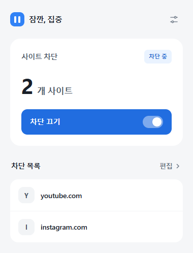

# 잠깐, 집중

방해되는 사이트를 버튼 하나로 차단하는 **Chrome 확장 프로그램**입니다.
차단할 사이트를 저장하고, 집중할 때 켜고 쉴 때 끄세요. 타이머 없이 직접 켜고 끄는 방식입니다.

## 설치

**Chrome 120 이상**에서 사용할 수 있습니다. 별도 프로그램 설치나 빌드는 필요 없습니다.

1. [프로젝트 ZIP 다운로드](https://github.com/hwankr/site-pause/archive/refs/heads/main.zip) 후 압축을 풉니다. 이미 Git으로 받았다면 이 단계는 건너뛰세요.
2. Chrome 주소창에 `chrome://extensions`를 입력합니다.
3. 오른쪽 위 **개발자 모드**를 켜고 **압축해제된 확장 프로그램을 로드합니다**를 누릅니다.
4. 받은 프로젝트 안의 **`outputs/site-pause` 폴더**를 선택합니다. 바로 안에 `manifest.json`이 있는 폴더입니다.
5. Chrome 도구 모음의 **확장 프로그램(퍼즐 아이콘)**에서 **잠깐, 집중**을 고정합니다.

> 설치 후에도 불러온 폴더는 이동하거나 삭제하지 마세요. [Chrome 공식 설치 안내](https://developer.chrome.com/docs/extensions/get-started/tutorial/hello-world#load-unpacked)

## 사용 방법

처음에는 차단 목록이 비어 있고, 차단도 꺼져 있습니다.

1. 도구 모음의 **잠깐, 집중** 아이콘 → 차단 목록의 **추가**를 누릅니다. 이미 등록한 사이트가 있으면 **편집**으로 표시됩니다.
2. `youtube.com`처럼 주소를 입력하고 **추가 → 저장**을 누릅니다. 아래 YouTube·Instagram·X·Reddit 버튼으로도 추가할 수 있습니다.
3. 팝업에서 **차단 켜기**를 누릅니다. **차단 중** 표시와 아이콘의 **ON** 배지가 나타납니다.
4. 쉬고 싶을 때 **차단 끄기**를 누릅니다. 차단됐던 탭에서는 **사이트 열기**를 눌러 돌아갑니다.

**목록 수정:** **편집**에서 사이트를 추가하거나 주소 옆 **×**로 삭제한 뒤, 반드시 **저장**하세요. 차단이 켜져 있으면 저장 즉시 적용됩니다.

## 알아둘 점

- **사이트 전체 차단:** `youtube.com`을 등록하면 `www.youtube.com`, `m.youtube.com`도 차단됩니다. URL을 붙여 넣어도 특정 페이지만 차단하지는 않습니다. 최대 200개까지 등록할 수 있습니다.
- **열린 탭에도 적용:** 차단을 켜면 이미 열려 있는 대상 탭도 차단 화면으로 바뀝니다. 작성 중인 내용은 먼저 저장하세요.
- **설정 유지:** Chrome을 다시 열어도 목록과 켜짐·꺼짐 상태가 유지됩니다. 자동으로 차단이 해제되지는 않습니다.
- **적용 범위:** 설치한 Chrome 프로필에 적용됩니다. 시크릿 창에서 쓰려면 확장 프로그램 **세부정보 → 시크릿 모드에서 허용**을 켜세요.

## 잘 안 될 때

| 상황 | 확인할 내용 |
| --- | --- |
| 설치할 때 `manifest.json`을 찾지 못함 | 프로젝트 최상위가 아닌 `outputs/site-pause` 폴더를 선택했는지 확인하세요. |
| **차단 켜기**를 누를 수 없음 | 사이트를 1개 이상 추가하고 **저장**하세요. |
| 등록한 사이트가 계속 열림 | 목록 저장 및 **차단 중** 상태를 확인하고, 확장 프로그램 **세부정보 → 사이트 액세스 → 모든 사이트**로 설정하세요. |

## 저장 정보와 권한

차단 목록과 켜짐·꺼짐 상태는 **현재 브라우저에만 저장**합니다. 외부 서버나 분석 도구를 사용하지 않으며, 방문 기록을 수집해 저장하지 않습니다.

`storage`는 설정 저장, `declarativeNetRequest`와 HTTP·HTTPS 사이트 접근 권한은 등록한 사이트의 차단에 사용합니다.
