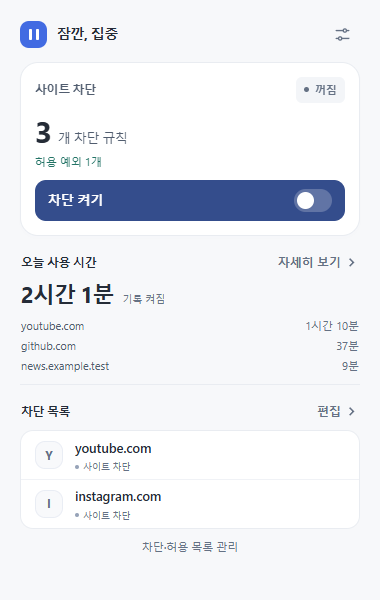
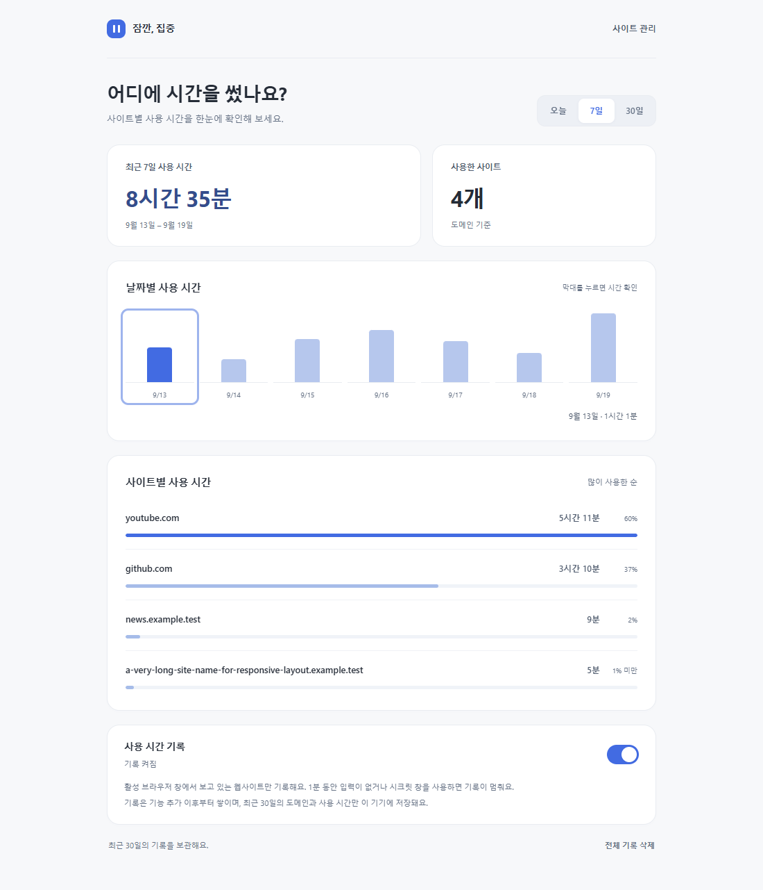
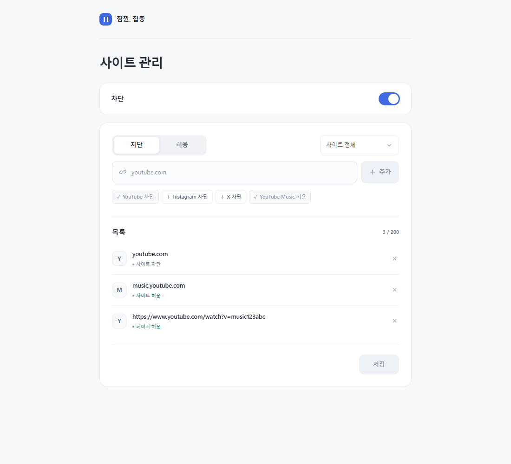

# 잠깐, 집중

방해되는 사이트나 특정 페이지만 차단하는 **Chrome 확장 프로그램**입니다.
허용할 사이트·페이지를 예외로 저장하고, 집중할 때 켜고 쉴 때 끄세요. 타이머 없이 직접 켜고 끄는 방식입니다.
사이트별 사용 시간도 확인할 수 있습니다. 현재 보고 있는 탭의 시간을 모아 오늘과 최근 7일·30일의 사용량을 보여줍니다.

## 설치

**Chrome 120 이상**에서 사용할 수 있습니다. 별도 프로그램 설치나 빌드는 필요 없습니다.

1. [프로젝트 ZIP 다운로드](https://github.com/hwankr/site-pause/archive/refs/heads/main.zip) 후 압축을 풉니다. 이미 Git으로 받았다면 이 단계는 건너뛰세요.
2. Chrome 주소창에 `chrome://extensions`를 입력합니다.
3. 오른쪽 위 **개발자 모드**를 켜고 **압축해제된 확장 프로그램을 로드합니다**를 누릅니다.
4. 받은 프로젝트 안의 **`outputs/site-pause` 폴더**를 선택합니다. 바로 안에 `manifest.json`이 있는 폴더입니다.
5. Chrome 도구 모음의 **확장 프로그램(퍼즐 아이콘)**에서 **잠깐, 집중**을 고정합니다.

> 설치 후에도 불러온 폴더는 이동하거나 삭제하지 마세요. [Chrome 공식 설치 안내](https://developer.chrome.com/docs/extensions/get-started/tutorial/hello-world#load-unpacked)

이미 설치했다면 파일을 업데이트한 뒤 `chrome://extensions`에서 **잠깐, 집중의 새로고침**을 누르세요. 기존 차단 목록과 설정은 유지되며, 사용 시간은 업데이트 이후부터 기록합니다. 이전 방문 기록은 가져오지 않습니다.

## 사용 방법

처음에는 차단 목록이 비어 있고, 차단도 꺼져 있습니다.

1. 도구 모음의 **잠깐, 집중** 아이콘 → 차단 목록의 **추가**를 누릅니다. 이미 등록한 사이트가 있으면 **편집**으로 표시됩니다.
2. **차단 / 허용**을 고르고, 옆의 적용 범위를 **사이트 전체** 또는 **특정 페이지**로 선택합니다. 주소를 입력하고 **추가 → 저장**을 누르세요. 아래 빠른 추가 버튼으로도 등록할 수 있습니다.
3. 팝업에서 **차단 켜기**를 누릅니다. **차단 중** 표시와 아이콘의 **ON** 배지가 나타납니다.
4. 쉬고 싶을 때 **차단 끄기**를 누릅니다. 차단됐던 탭에서는 **사이트 열기**를 눌러 돌아갑니다.

**목록 수정:** **편집**에서 사이트를 추가하거나 주소 옆 **×**로 삭제한 뒤, 반드시 **저장**하세요. 차단이 켜져 있으면 저장 즉시 적용됩니다.

## 사이트별 사용 시간

팝업에서 **오늘의 총 사용 시간과 많이 사용한 사이트**를 확인할 수 있습니다. **자세히 보기**를 누르거나 사이트 관리 상단의 **사용 시간**을 누르면 **오늘 / 최근 7일 / 최근 30일**의 사이트별 순위와 날짜별 그래프가 열립니다.

- **기록 시작:** 처음에는 켜져 있습니다. 차단 켜짐·꺼짐과 별개로 동작하며, 상세 화면에서 기록을 일시정지하거나 다시 시작할 수 있습니다.
- **시간을 세는 기준:** 현재 포커스된 Chrome 창에서 보고 있는 `http`·`https` 탭만 기록합니다. 백그라운드 탭, 다른 앱을 사용하는 시간, Chrome 내부 화면은 제외합니다. 시스템에서 60초 동안 입력이 없거나 화면이 잠기면 기록을 멈춥니다.
- **시크릿 창:** 시크릿 모드에서 차단을 허용했더라도 사용 시간은 기록하지 않습니다.
- **보관과 삭제:** 컴퓨터의 현지 날짜를 기준으로 오늘을 포함한 최근 30일만 보관합니다. 상세 화면에서 사용 기록을 삭제할 수 있으며, 차단 목록과 설정은 유지됩니다.

사용 시간은 근사값입니다. 약 30초마다 상태를 확인하며, 확인이 오래 지연되거나 컴퓨터가 절전 상태였던 구간은 제외하므로 실제 사용 시간과 차이가 날 수 있습니다.

## 특정 페이지만 차단하거나 허용하기

| 차단/허용 + 적용 범위 | 입력 예시 | 적용 결과 |
| --- | --- | --- |
| **차단** + **사이트 전체** | `youtube.com` | 해당 도메인과 모든 하위 도메인을 차단합니다. |
| **차단** + **특정 페이지** | `https://example.com/feed` | 등록한 페이지만 차단합니다. 다른 페이지는 열립니다. |
| **허용** + **사이트 전체** | `music.youtube.com` | 해당 도메인과 하위 도메인을 차단 예외로 둡니다. |
| **허용** + **특정 페이지** | 듣고 싶은 YouTube 영상 URL | 해당 페이지만 차단 예외로 둡니다. |

**YouTube를 차단하면서 노래는 듣고 싶다면:** **차단 + 사이트 전체**를 선택해 `youtube.com`을 추가하고, **허용 + 특정 페이지**로 바꿔 듣고 싶은 영상 URL을 추가하세요. YouTube Music 전체를 허용하려면 **허용 + 사이트 전체**로 `music.youtube.com`을 추가하거나 **YouTube Music 허용** 빠른 추가 버튼을 누르세요. 마지막으로 **저장**을 누르면 적용됩니다.

허용 규칙은 차단 규칙보다 우선합니다. 허용 목록은 등록한 차단의 예외이며, 허용하지 않은 모든 사이트를 차단하는 기능은 아닙니다.

일반 페이지는 `http`/`https`, 호스트, 경로, 쿼리 문자열까지 일치해야 합니다. `#` 뒤의 위치 정보는 무시하며, 하위 경로까지 자동으로 포함하지 않습니다. 페이지 URL은 여러 개를 붙여 넣을 때 줄바꿈으로 구분하세요.

YouTube 영상은 영상 ID를 기준으로 구분합니다. `youtu.be` 공유 링크와 `youtube.com`, `www.youtube.com`, `m.youtube.com`, `music.youtube.com`의 같은 영상이 함께 적용되며, 재생 시각·공유 추적·재생목록 매개변수는 무시합니다. 허용한 영상에서 다른 영상으로 이동하면 다시 차단됩니다. 재생목록 주소를 등록해도 재생목록의 모든 영상이 자동으로 허용되지는 않습니다.

## 알아둘 점

- **등록 한도:** 차단·허용 목록을 합쳐 최대 200개까지 등록할 수 있습니다. 기존에 저장한 사이트 차단 목록은 그대로 유지됩니다.
- **열린 탭에도 적용:** 차단을 켜면 이미 열려 있는 대상 탭도 차단 화면으로 바뀝니다. 작성 중인 내용은 먼저 저장하세요.
- **설정 유지:** Chrome을 다시 열어도 목록과 켜짐·꺼짐 상태가 유지됩니다. 자동으로 차단이 해제되지는 않습니다.
- **적용 범위:** 설치한 Chrome 프로필에 적용됩니다. 시크릿 창에서도 차단하려면 확장 프로그램 **세부정보 → 시크릿 모드에서 허용**을 켜세요. 시크릿 창의 사용 시간은 기록하지 않습니다.

## 잘 안 될 때

| 상황 | 확인할 내용 |
| --- | --- |
| 설치할 때 `manifest.json`을 찾지 못함 | 프로젝트 최상위가 아닌 `outputs/site-pause` 폴더를 선택했는지 확인하세요. |
| **차단 켜기**를 누를 수 없음 | 사이트 차단 또는 페이지 차단을 1개 이상 추가하고 **저장**하세요. 허용 규칙만으로는 차단을 켤 수 없습니다. |
| 등록한 사이트가 계속 열림 | 목록 저장 및 **차단 중** 상태와 겹치는 허용 규칙을 확인하고, 확장 프로그램 **세부정보 → 사이트 액세스 → 모든 사이트**로 설정하세요. |
| 사용 시간이 보이지 않음 | 기록이 일시정지되어 있지 않은지 확인하세요. 일반 Chrome 창에서 웹사이트를 사용한 뒤 확인하면 표시됩니다. 설치·업데이트 이전의 시간은 표시되지 않습니다. |
| 업데이트 후 새로고침 안내가 뜨거나 오류에 **지원하지 않는 요청이에요**가 남음 | 이전 버전의 실행 코드가 남아 있을 수 있습니다. 팝업의 **확장 프로그램 새로고침**을 누르거나 `chrome://extensions`에서 새로고침한 뒤 팝업을 다시 여세요. 저장한 목록과 사용 기록은 유지됩니다. 오류 화면에는 이전 오류 기록이 남아 있을 수 있습니다. |

## 저장 정보와 권한

차단·허용 목록과 켜짐·꺼짐 상태, 사용 시간 기록 설정 및 **사이트 도메인별 하루 사용 시간**은 **현재 브라우저에만 저장**합니다. 사용 시간 기록에는 페이지 경로·제목·전체 방문 내역을 저장하지 않습니다. 사용 시간 기록은 최근 30일만 보관하며 언제든 일시정지하거나 삭제할 수 있습니다. 외부 서버나 분석 도구는 사용하지 않습니다.

`storage`는 설정과 사용 시간 저장, `declarativeNetRequest`와 HTTP·HTTPS 사이트 접근 권한은 등록한 주소의 차단·허용과 사용 중인 사이트 확인에 사용합니다. `webNavigation`은 YouTube처럼 전체 페이지를 새로 불러오지 않고 이동하는 사이트에서도 규칙을 적용하는 데 사용합니다. `alarms`는 약 30초 간격의 사용 시간 확인, `idle`은 미사용·화면 잠금 상태를 확인하여 시간 기록을 멈추는 데 사용합니다.
